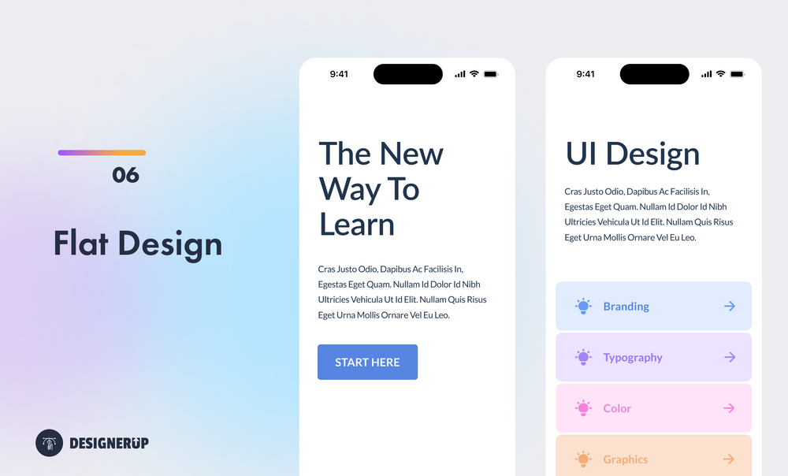

# Mahina

A comprehensive QML component library for Qt 6 desktop applications — fully themed, AOT-compiled, and keyboard-friendly.



## Features

- **257 components** covering layout, navigation, data display, forms, charts, overlays, editors and more
- **Single design token source** — every component reads from the `Theme` singleton; swap colours, radii and typography in one place
- **AOT-safe** — all QML passes `qmlsc` strict-mode compilation; no runtime type errors
- **Desktop-first** — interactions are designed for keyboard and mouse; no mobile-only patterns
- **Zero external dependencies** — plain Qt 6, no web engine, no JavaScript runtime
- **Bundled fonts** — [Inter](https://rsms.me/inter/) (UI), [JetBrains Mono](https://www.jetbrains.com/lp/mono/) (mono), and [Phosphor Icons](https://phosphoricons.com) (900+ glyphs, six weights) shipped as embedded Qt resources

## Requirements

| Dependency | Minimum version |
|---|---|
| Qt | 6.5 |
| CMake | 3.21 |
| C++ | 17 |

## Integration

### Via FetchContent (recommended)

No installation required — CMake downloads and builds Mahina automatically:

```cmake
include(FetchContent)
FetchContent_Declare(Mahina
    GIT_REPOSITORY https://github.com/ajunior/mahina.git
    GIT_TAG        v0.1.0
)
FetchContent_MakeAvailable(Mahina)

target_link_libraries(MyApp PRIVATE
    Qt6::Quick Mahina Mahinaplugin Mahinaplugin_init)
```

### As a subdirectory (source build)

```cmake
add_subdirectory(mahina)

target_link_libraries(MyApp PRIVATE
    Qt6::Quick
    Mahina
    Mahinaplugin
    Mahinaplugin_init
)
```

### As an installed package

```bash
cmake -B build -DCMAKE_PREFIX_PATH=/path/to/Qt/6.x/gcc_64 \
               -DCMAKE_INSTALL_PREFIX=/usr/local
cmake --build build -j$(nproc)
cmake --install build
```

Then in your project:

```cmake
find_package(Mahina REQUIRED)

# Option A — Qt-native projects using qt_add_executable:
#   qt_import_qml_plugins handles the static plugin init automatically.
target_link_libraries(MyApp PRIVATE Mahina::Mahina Mahina::Mahinaplugin)
qt_import_qml_plugins(MyApp)

# Option B — plain CMake executables:
#   Link Mahina::All, which also adds the Q_IMPORT_PLUGIN shim to your sources.
target_link_libraries(MyApp PRIVATE Mahina::All)
```

In both cases, add the QML import path at runtime:

```cpp
engine.addImportPath(QStringLiteral("qrc:/qt/qml"));
```

Then import the module in any QML file:

```qml
import Mahina

Button {
    text: "Hello, Mahina!"
    variant: Button.Variant.Filled
    onClicked: console.log("clicked")
}
```

## Bundled assets

Mahina ships three font families as embedded Qt resources — no system installation required.

Register them in `main.cpp` before loading the QML engine:

```cpp
#include <QFontDatabase>

// UI and mono fonts
QFontDatabase::addApplicationFont(":/qt/qml/Mahina/assets/fonts/InterVariable.ttf");
QFontDatabase::addApplicationFont(":/qt/qml/Mahina/assets/fonts/JetBrainsMonoVariable.ttf");

// Phosphor Icons (all six weights)
QFontDatabase::addApplicationFont(":/qt/qml/Mahina/assets/fonts/Phosphor-Regular.ttf");
QFontDatabase::addApplicationFont(":/qt/qml/Mahina/assets/fonts/Phosphor-Thin.ttf");
QFontDatabase::addApplicationFont(":/qt/qml/Mahina/assets/fonts/Phosphor-Light.ttf");
QFontDatabase::addApplicationFont(":/qt/qml/Mahina/assets/fonts/Phosphor-Bold.ttf");
QFontDatabase::addApplicationFont(":/qt/qml/Mahina/assets/fonts/Phosphor-Fill.ttf");
QFontDatabase::addApplicationFont(":/qt/qml/Mahina/assets/fonts/Phosphor-Duotone.ttf");
```

| Asset | Token | Description |
|---|---|---|
| Inter (variable, v4.0) | `Theme.fontFamily` | UI font used by all components |
| JetBrains Mono (variable, v2.3) | `Theme.fontFamilyMono` | Monospace font for code and terminal components |
| Phosphor Icons (six weights) | `Icons.*` | 900+ icon glyphs via the `Icon` component |

Both font tokens are writable and supported by `Theme.load()`, so you can swap them for any font your app registers.

## Building the example app

```bash
git clone <repo-url> mahina
cd mahina
cmake -B build -DCMAKE_PREFIX_PATH=/path/to/Qt/6.x/gcc_64
cmake --build build -j$(nproc)
./build/example/bin/MahinaExample
```

## Theme

All visual properties are exposed through the `Theme` singleton — import it anywhere:

```qml
import Mahina

Rectangle {
    color:  Theme.surface
    radius: Theme.radiusMd

    Text {
        color: Theme.textPrimary
        font.family: Theme.fontFamily
        font.pixelSize: Theme.textBase
    }
}
```

Toggle dark mode at runtime:

```qml
Theme.dark = !Theme.dark
```

**Available tokens**

| Group | Tokens |
|---|---|
| Colours | `primary` `info` `success` `warning` `error` `panel` `surface` `surfaceVariant` `border` `textPrimary` `textSecondary` `textDisabled` |
| Typography | `fontFamily` `fontFamilyMono` `textXs` `textSm` `textBase` `textLg` `textXl` |
| Spacing | `sp1` … `sp16` |
| Radii | `radiusSm` `radiusMd` `radiusLg` `radiusFull` |

## Components

Mahina ships 258 components across nine categories.
Full documentation with descriptions, usage notes, best-fit scenarios, and a properties reference table is available in [`docs/index.html`](docs/index.html).

| Category | Count | Examples |
|---|---|---|
| Layout | 22 | `Accordion` `SplitPane` `Sidebar` `SidebarSection` `SidebarEntry` |
| Navigation | 20 | `CommandPalette` `Ribbon` `MenuBar` `Tabs` `Breadcrumb` |
| Display | 41 | `DataGrid` `VirtualTable` `ModelTable` `ListRow` `Card` `Tree` `JsonViewer` |
| Inputs | 56 | `DatePicker` `ColorPicker` `TransferList` `TagInput` `MultiSelect` |
| Charts | 29 | `AreaChart` `GanttChart` `NodeEditor` `KeyframeEditor` `LiveChart` |
| Feedback | 32 | `Toaster` `Dialog` `ProgressBar` `Skeleton` `Tooltip` |
| Editors | 27 | `CodeEditor` `DiffEditor` `HexViewer` `SpreadsheetGrid` `Terminal` |
| Utility | 24 | `Kanban` `Tour` `ImageComparison` `EventCalendar` `QRCode` |
| Communication | 7 | `Chat` `CommentThread` `PresenceList` `ReactionBar` `VideoCallTile` |

## ModelTable and the model contract

Most components take plain JavaScript arrays. `ModelTable` is the exception: it
binds a `QAbstractItemModel` directly so large result sets stay in C++ and are
never copied into JS. In exchange, the model must expose two roles by name:

| Role | Type | Meaning |
|---|---|---|
| `display` | `QString` | Cell text. Never return a null `QVariant` — pass an empty string instead. |
| `isNull` | `bool` | `true` when the cell holds no value. |

Both are bound as **required** delegate properties. A model missing either will
fail to instantiate the delegate — the table renders empty and Qt logs
`Error incubating delegate` to the console.

The `isNull` role is what allows a NULL to render distinctly (italic, dimmed,
`NULL`) from a present-but-empty string. Collapsing the two is a real hazard for
database front-ends, so the role is mandatory rather than optional.

```cpp
QHash<int, QByteArray> MyModel::roleNames() const
{
    return {
        { Qt::DisplayRole, QByteArrayLiteral("display") },
        { IsNullRole,      QByteArrayLiteral("isNull")  },
    };
}
```

Optionally, implement `headerData()` for column titles and a `Q_INVOKABLE
sort(int column, Qt::SortOrder)` to enable click-to-sort headers; `ModelTable`
calls `sort()` only if the model provides it.

> **Note:** QML's `TableModel` cannot drive `ModelTable` — `TableModelColumn`
> only maps Qt's built-in item roles and has no way to supply `isNull`. Use a
> C++ model; see [`example/DemoTableModel.h`](example/DemoTableModel.h) for a
> minimal conforming implementation.

## MahinaExtras

`MahinaExtras` is an optional companion library that adds native C++ capabilities to Mahina without breaking the pure-QML build. It is **not built by default** — enable it with `-DMAHINA_EXTRAS=ON`.

### Syntax highlighting

`SyntaxHighlighter` is a QML element backed by `QSyntaxHighlighter`. It attaches to any `CodeEditor` via its `textDocument` property and highlights code in real time.

```qml
import Mahina
import MahinaExtras

CodeEditor {
    id: editor
    language: "sql"

    SyntaxHighlighter {
        document: editor.textDocument
        language: editor.language
        darkMode: Theme.dark
    }
}
```

Supported values for the `language` property:

| Value(s) | Language |
|---|---|
| `"sql"` | SQL |
| `"qml"` `"js"` `"javascript"` `"ts"` `"typescript"` | QML / JavaScript / TypeScript |
| `"python"` `"py"` | Python |
| `"json"` | JSON |
| `"bash"` `"sh"` `"shell"` | Bash / Shell |
| `"cpp"` `"c++"` `"c"` `"h"` `"hpp"` | C / C++ |
| `"java"` | Java |
| `"rust"` `"rs"` | Rust |
| `"go"` `"golang"` | Go |
| `"html"` `"htm"` | HTML |
| `"css"` `"scss"` `"less"` | CSS |
| `"yaml"` `"yml"` | YAML |
| `"xml"` `"svg"` `"xaml"` | XML |

An empty or unrecognised value is accepted — the editor renders plain monochrome text.

The color scheme follows GitHub's dark/light palette and switches automatically when `darkMode` changes.

### Linking MahinaExtras

```cmake
target_link_libraries(MyApp PRIVATE
    Qt6::Quick
    Mahina Mahinaplugin Mahinaplugin_init
    MahinaExtras MahinaExtrasplugin MahinaExtrasplugin_init
)
```

## Changelog

### Unreleased

- **New** IRC components — `IrcTextView` (message pane: mIRC control codes, per-nick colouring, highlights, clickable URLs, unread marker, cross-line selection), `IrcNickList` (virtualised, mode-sorted roster) and `IrcInput` (Tab-cycle nick/command completion, send history), sharing colour rules via the new `IrcPalette` singleton
- **Docs** `ModelTable`'s model contract is now documented — models must expose `display` and `isNull` roles; added `example/DemoTableModel` as a minimal conforming `QAbstractTableModel`
- **Fix** Example app failed to start — `SchemaBrowser` in `example/main.qml` still used the removed `schema` prop; migrated to `schemas`
- **Fix** Example `ModelTable` demo rendered empty — it used QML `TableModel`, which cannot supply the required `isNull` role; replaced with `DemoTableModel`

- **New** `ModelTable` component — themed table backed by `QAbstractItemModel`; rows stay in the C++ model with no JS array copy, uses Qt Quick's native `TableView` for virtualized rendering
- **New** `MahinaExtras` companion library — optional C++ extensions including `SyntaxHighlighter` for `CodeEditor` (13 languages)
- **New** `SidebarSection` and `SidebarEntry` layout components
- **New** `Theme.load(obj)` and `Theme.reset()` — runtime theme switching from a partial or full color schema
- **New** Bundled fonts: [Inter](https://rsms.me/inter/) (variable) and [JetBrains Mono](https://www.jetbrains.com/lp/mono/) (variable) as official UI and mono fonts; `Theme.fontFamily` and `Theme.fontFamilyMono` are now writable and supported by `Theme.load()`
- **Fix** `Checkbox` and `Radio` label text now vertically centered with the indicator — zeroed control padding and replaced the Item wrapper with a plain Text sized to the indicator height
- **Fix** `Input` text cursor now vertically centered within the field box regardless of whether a label or helper/error text is present
- **Feat** `Toaster` gains an optional copy-to-clipboard button — pass `true` as the fourth argument to `show()` to enable it per toast
- **Fix** `Alert`, `AlertStack`, and `Toaster` are now fully square — removes the visual conflict between rounded corners and the left accent stripe
- **Fix** `AlertStack` delegate background and accent stripe are now square, consistent with `Alert` and `Toaster`
- **Docs** Reference section now shows a properties table (name, type, default, description) for 14 core components; remaining components can be filled in incrementally
- **New** `ListRow` component — list row with title, subtitle, animated hover highlight, and a trailing default-property slot for Badges, Buttons, or any item; exposes a `hovered` alias so parent delegates can conditionally show actions
- **Fix** `Theme.fontFamily` default corrected from `"Inter"` to `"Inter Variable"` to match the actual family name in the bundled variable font
- **Fix** `RulerBar`, `KeyframeEditor`, and `GradientText` now quote multi-word font family names in Canvas2D font strings — unquoted names like `Inter Variable` were being mangled to `InterVariable` by Qt's CSS font parser
- **Feat** `CodeEditor` gains find/replace — `Ctrl+F` opens a floating find bar; `Ctrl+H` opens find+replace; Enter/Shift+Enter navigates matches; Replace and Replace All buttons; match counter shows current position; Escape closes the bar
- **Feat** `CodeEditor` gains `highlightCurrentLine` prop (default `false`) — opt-in cursor-line highlight with a subtle primary-colour tint
- **Feat** `CodeEditor` gains `insertSpacesForTab` prop (default `true`) — set to `false` to insert a literal tab character instead of spaces
- **Feat** `CodeEditor` gains `lineHeight` prop (default `1.0`) — proportional line height multiplier for adjustable line spacing
- **Feat** `CodeEditor` now uses squared corners (radius 0) to match dense workspace UIs, consistent with `SchemaBrowser`
- **Feat** `CodeEditor` gains gutter decorations — set `lineDecorations` to an array of `{ line, icon, color }` objects to render status icons beside any line number (e.g. SQL execution results, linter errors, breakpoints)
- **Feat** `KeyboardShortcutsPanel` gains `closeOnEsc` prop (default `true`) — set to `false` to prevent Escape from closing the panel when the parent handles Escape globally
- **Docs** Component categories corrected: `Rating`, `EditableTable`, `CopyButton`, `FloatingActionButton` moved to Inputs; `StatusBar` moved to Layout; `FileManager`, `FloatingIsland`, `FloatingToolbar` moved to Utility
- **Docs** `Badge`, `Accordion`, and `ListRow` reference entries overhauled — corrected inaccurate descriptions and broken examples; added missing props (`backgroundOpacity` for Badge; full props table for Accordion); added `hovered`-driven example for ListRow
- **Feat** `SchemaBrowser` upgraded to a 3-level tree (schema → table → column) — `schemas` prop accepts `[{name, tables: [{name, type, columns}]}]`; schema nodes expand/collapse with animated carets and auto-expand on load
- **Feat** `SchemaBrowser` search bar gains an × clear button — appears when the field is non-empty, clears the filter on click
- **Feat** `SchemaBrowser` gains `databaseName` prop — shown in the header (e.g. `myapp_production (3)`); falls back to "Schemas" when empty
- **Break** `SchemaBrowser`: removed the legacy `schema` flat-list prop; use `schemas` with at least one schema object

## License

[MIT](LICENSE)

### Bundled fonts

The embedded font files in `assets/fonts/` are third-party works, redistributed under their own terms (full texts in `assets/fonts/licenses/`):

| Font | License | Source |
|---|---|---|
| Inter | SIL Open Font License 1.1 | [rsms/inter](https://github.com/rsms/inter) |
| JetBrains Mono | SIL Open Font License 1.1 | [JetBrains/JetBrainsMono](https://github.com/JetBrains/JetBrainsMono) |
| Phosphor Icons | MIT | [phosphor-icons](https://github.com/phosphor-icons/web) |
