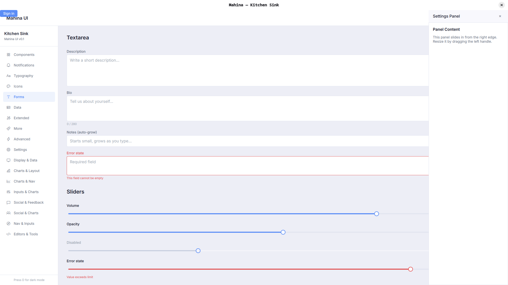

# Mahina

A comprehensive QML component library for Qt 6 desktop applications — fully themed, AOT-compiled, and keyboard-friendly.

[](https://github.com/ajunior/mahina/actions/workflows/ci.yml)



## Features

- **262 components** covering layout, navigation, data display, forms, charts, overlays, editors and more
- **Single design token source** — every component reads from the `Theme` singleton; swap colours, radii and typography in one place
- **AOT-compiled** — around 88% of the library's bindings and functions are compiled ahead of time to C++ rather than interpreted; CI reports the figure on every change
- **Desktop-first** — interactions are designed for keyboard and mouse; no mobile-only patterns
- **Zero external dependencies** — plain Qt 6, no web engine, no JavaScript runtime
- **Bundled fonts** — [Inter](https://rsms.me/inter/) (UI), [JetBrains Mono](https://www.jetbrains.com/lp/mono/) (mono), and [Phosphor Icons](https://phosphoricons.com) (900+ glyphs, six weights) shipped as embedded Qt resources

## Requirements

| Dependency | Minimum version |
|---|---|
| Qt | 6.5 |
| CMake | 3.21 |
| C++ | 17 |

## Integration

### Via FetchContent (recommended)

No installation required — CMake downloads and builds Mahina automatically:

```cmake
include(FetchContent)
FetchContent_Declare(Mahina
    GIT_REPOSITORY https://github.com/ajunior/mahina.git
    GIT_TAG        v0.45.3
)
FetchContent_MakeAvailable(Mahina)

target_link_libraries(MyApp PRIVATE
    Qt6::Quick Mahina Mahinaplugin Mahinaplugin_init)
```

### Declare the QML dependency

Linking is enough to *run*, but not enough for the tooling. Qt builds the import
path it hands `qmlcachegen` and `qmllint` from your target's QML module
dependencies — so unless you declare Mahina as one, neither can resolve a single
Mahina type. Nothing fails: the build succeeds, the app runs, and every binding
that touches `Theme`, `Button` or any other Mahina type quietly drops out of
ahead-of-time compilation and falls back to the interpreter.

```cmake
qt_policy(SET QTP0005 NEW)   # lets DEPENDENCIES take a target, not just a URI

qt_add_qml_module(MyApp
    URI MyApp
    VERSION 1.0
    DEPENDENCIES TARGET Mahina
    QML_FILES ...
)
```

`TARGET` is the part that matters: given a bare URI, Qt cannot locate the
module's directory in your build tree and adds nothing to the import path. It
requires policy `QTP0005` (Qt 6.8+).

Check the result with the `all_aotstats` target — it prints the share of
bindings compiled ahead of time per module. In one real application this single
declaration moved the app's own module from 22% to 70%.

### As a subdirectory (source build)

```cmake
add_subdirectory(mahina)

target_link_libraries(MyApp PRIVATE
    Qt6::Quick
    Mahina
    Mahinaplugin
    Mahinaplugin_init
)
```

### Build options

When Mahina is consumed by another project (FetchContent or `add_subdirectory`),
it builds the library and nothing else — the demo app is skipped and no install
rules are generated, so `cmake --install` on the parent project stays clean.
Both default to `ON` only when Mahina is the top-level project.

| Option | Default | Effect |
| --- | --- | --- |
| `MAHINA_EXAMPLE` | top-level only | Build the `MahinaExample` demo app |
| `MAHINA_INSTALL` | top-level only | Generate Mahina's install rules |
| `MAHINA_EXTRAS`  | `OFF` | Build the [MahinaExtras](#mahinaextras) C++ companion library |

Override either explicitly, e.g. `-DMAHINA_INSTALL=ON` in a superbuild that
really does want to install Mahina alongside its own targets.

### As an installed package

```bash
cmake -B build -DCMAKE_PREFIX_PATH=/path/to/Qt/6.x/gcc_64 \
               -DCMAKE_INSTALL_PREFIX=/usr/local
cmake --build build -j$(nproc)
cmake --install build
```

Then in your project:

```cmake
find_package(Qt6 REQUIRED COMPONENTS Quick)
qt_standard_project_setup()
find_package(Mahina REQUIRED)

qt_add_executable(MyApp main.cpp)
qt_add_qml_module(MyApp URI MyApp VERSION 1.0 QML_FILES Main.qml)

# Mahina::All links the backing library and the QML plugin, and adds the
# Q_IMPORT_PLUGIN shim to your sources. Link it whether or not your project
# uses qt_add_executable.
target_link_libraries(MyApp PRIVATE Qt6::Quick Mahina::All)
```

`qt_import_qml_plugins()` is **not** an alternative here: it discovers plugins by
walking the Qt-generated properties on real Qt QML module targets, and an installed
Mahina is a set of hand-written `IMPORTED` targets it cannot see. Linking
`Mahina::Mahina Mahina::Mahinaplugin` and calling it leaves the plugin
uninitialised, and the app dies at startup with `module "Mahina" is not installed`.
`Mahina::All` is the one path that works.

Then add the QML import path at runtime:

```cpp
engine.addImportPath(QStringLiteral("qrc:/qt/qml"));
```

Then import the module in any QML file:

```qml
import Mahina

Button {
    text: "Hello, Mahina!"
    variant: Button.Variant.Filled
    onClicked: console.log("clicked")
}
```

## Bundled assets

Mahina ships three font families as embedded Qt resources — no system installation required.

Register them in `main.cpp` before loading the QML engine:

```cpp
#include <QFontDatabase>

// UI and mono fonts
QFontDatabase::addApplicationFont(":/qt/qml/Mahina/assets/fonts/InterVariable.ttf");
QFontDatabase::addApplicationFont(":/qt/qml/Mahina/assets/fonts/JetBrainsMonoVariable.ttf");

// Phosphor Icons (all six weights)
QFontDatabase::addApplicationFont(":/qt/qml/Mahina/assets/fonts/Phosphor-Regular.ttf");
QFontDatabase::addApplicationFont(":/qt/qml/Mahina/assets/fonts/Phosphor-Thin.ttf");
QFontDatabase::addApplicationFont(":/qt/qml/Mahina/assets/fonts/Phosphor-Light.ttf");
QFontDatabase::addApplicationFont(":/qt/qml/Mahina/assets/fonts/Phosphor-Bold.ttf");
QFontDatabase::addApplicationFont(":/qt/qml/Mahina/assets/fonts/Phosphor-Fill.ttf");
QFontDatabase::addApplicationFont(":/qt/qml/Mahina/assets/fonts/Phosphor-Duotone.ttf");
```

| Asset | Token | Description |
|---|---|---|
| Inter (variable, v4.0) | `Theme.fontFamily` | UI font used by all components |
| JetBrains Mono (variable, v2.3) | `Theme.fontFamilyMono` | Monospace font for code and terminal components |
| Phosphor Icons (six weights) | `Icons.*` | 900+ icon glyphs via the `Icon` component |

Both font tokens are writable and supported by `Theme.load()`, so you can swap them for any font your app registers.

## Building the example app

```bash
git clone <repo-url> mahina
cd mahina
cmake -B build -DCMAKE_PREFIX_PATH=/path/to/Qt/6.x/gcc_64
cmake --build build -j$(nproc)
./build/example/bin/MahinaExample
```

## Development

Every check CI runs lives in `scripts/ci-check.sh`, so a red pipeline is
reproduced locally with one command rather than by reading YAML:

```bash
CMAKE_PREFIX_PATH=/path/to/Qt/6.x/gcc_64 bash scripts/ci-check.sh
```

It builds the library, the extras and the demo app, boots the demo app on Qt's
offscreen platform plugin, and runs `qmllint` over every QML file. Three notes
on what the gates actually assert:

- **The boot gate demands silence, not survival.** The demo app instantiates
  roughly 250 of Mahina's components, which makes starting it the closest thing
  the repo has to a test suite — but Qt reports a broken binding as a warning on
  stderr and carries on, so an exit code proves nothing. Any output at all fails
  the gate.
- **The lint gate is a ratchet.** `scripts/qmllint-baseline.txt` records a
  ceiling per warning category. A category may shrink freely; growing one, or
  introducing a new one, fails. Clear part of the backlog and lock the win in
  with `bash scripts/ci-check.sh --update-baseline`.
- **AOT coverage is printed, never enforced.** The number moves with the Qt
  version, so a threshold would fail for reasons unrelated to the change under
  review — but a change that quietly halves it is visible in its own run.

The baseline counts are tied to the Qt version CI pins, since `qmllint` gains
checks between releases; bump the two together.

## Theme

All visual properties are exposed through the `Theme` singleton — import it anywhere:

```qml
import Mahina

Rectangle {
    color:  Theme.surface
    radius: Theme.radiusMd

    Text {
        color: Theme.textPrimary
        font.family: Theme.fontFamily
        font.pixelSize: Theme.textBase
    }
}
```

Toggle dark mode at runtime:

```qml
Theme.dark = !Theme.dark
```

`hover` is the tint an otherwise-transparent element takes while the pointer is
over it. It is a translucent overlay (`#AARRGGBB`) rather than an opaque colour,
so the same value reads correctly whether the element sits on `background`,
`panel` or `surface` — change it once to retune hover across every component.

**Available tokens**

| Group | Tokens |
|---|---|
| Colours | `primary` `info` `success` `warning` `error` `panel` `surface` `surfaceVariant` `hover` `border` `textPrimary` `textSecondary` `textDisabled` |
| Typography | `fontFamily` `fontFamilyMono` `textXs` `textSm` `textBase` `textLg` `textXl` |
| Spacing | `sp1` … `sp16` |
| Radii | `radiusSm` `radiusMd` `radiusLg` `radiusFull` |

## Components

Mahina ships 262 components across nine categories.
Full documentation with descriptions, usage notes, best-fit scenarios, and a properties reference table is available in [`docs/index.html`](docs/index.html).

| Category | Count | Examples |
|---|---|---|
| Layout | 22 | `Accordion` `SplitPane` `Sidebar` `SidebarSection` `SidebarEntry` |
| Navigation | 20 | `CommandPalette` `Ribbon` `MenuBar` `Tabs` `Breadcrumb` |
| Display | 41 | `DataGrid` `VirtualTable` `ModelTable` `ListRow` `Card` `Tree` `JsonViewer` |
| Inputs | 56 | `DatePicker` `ColorPicker` `TransferList` `TagInput` `MultiSelect` |
| Charts | 29 | `AreaChart` `GanttChart` `NodeEditor` `KeyframeEditor` `LiveChart` |
| Feedback | 32 | `Toaster` `Dialog` `ProgressBar` `Skeleton` `Tooltip` |
| Editors | 27 | `CodeEditor` `DiffEditor` `HexViewer` `SpreadsheetGrid` `Terminal` |
| Utility | 24 | `Kanban` `Tour` `ImageComparison` `EventCalendar` `QRCode` |
| Communication | 7 | `Chat` `CommentThread` `PresenceList` `ReactionBar` `VideoCallTile` |

## ModelTable and the model contract

Most components take plain JavaScript arrays. `ModelTable` is the exception: it
binds a `QAbstractItemModel` directly so large result sets stay in C++ and are
never copied into JS. In exchange, the model must expose two roles by name:

| Role | Type | Meaning |
|---|---|---|
| `display` | `QString` | Cell text. Never return a null `QVariant` — pass an empty string instead. |
| `isNull` | `bool` | `true` when the cell holds no value. |

Both are bound as **required** delegate properties. A model missing either will
fail to instantiate the delegate — the table renders empty and Qt logs
`Error incubating delegate` to the console.

The `isNull` role is what allows a NULL to render distinctly (italic, dimmed,
`NULL`) from a present-but-empty string. Collapsing the two is a real hazard for
database front-ends, so the role is mandatory rather than optional.

```cpp
QHash<int, QByteArray> MyModel::roleNames() const
{
    return {
        { Qt::DisplayRole, QByteArrayLiteral("display") },
        { IsNullRole,      QByteArrayLiteral("isNull")  },
    };
}
```

Optionally, implement `headerData()` for column titles and a `Q_INVOKABLE
sort(int column, Qt::SortOrder)` to enable click-to-sort headers; `ModelTable`
calls `sort()` only if the model provides it.

> **Note:** QML's `TableModel` cannot drive `ModelTable` — `TableModelColumn`
> only maps Qt's built-in item roles and has no way to supply `isNull`. Use a
> C++ model; see [`example/DemoTableModel.h`](example/DemoTableModel.h) for a
> minimal conforming implementation.

## MahinaExtras

`MahinaExtras` is an optional companion library that adds native C++ capabilities to Mahina without breaking the pure-QML build. It is **not built by default** — enable it with `-DMAHINA_EXTRAS=ON`.

### Syntax highlighting

`SyntaxHighlighter` is a QML element backed by `QSyntaxHighlighter`. It attaches to any `CodeEditor` via its `textDocument` property and highlights code in real time.

```qml
import Mahina
import MahinaExtras

CodeEditor {
    id: editor
    language: "sql"

    SyntaxHighlighter {
        document: editor.textDocument
        language: editor.language
        darkMode: Theme.dark
    }
}
```

Supported values for the `language` property:

| Value(s) | Language |
|---|---|
| `"sql"` | SQL |
| `"qml"` `"js"` `"javascript"` `"ts"` `"typescript"` | QML / JavaScript / TypeScript |
| `"python"` `"py"` | Python |
| `"json"` | JSON |
| `"bash"` `"sh"` `"shell"` | Bash / Shell |
| `"cpp"` `"c++"` `"c"` `"h"` `"hpp"` | C / C++ |
| `"java"` | Java |
| `"rust"` `"rs"` | Rust |
| `"go"` `"golang"` | Go |
| `"html"` `"htm"` | HTML |
| `"css"` `"scss"` `"less"` | CSS |
| `"yaml"` `"yml"` | YAML |
| `"xml"` `"svg"` `"xaml"` | XML |

An empty or unrecognised value is accepted — the editor renders plain monochrome text.

The color scheme follows GitHub's dark/light palette and switches automatically when `darkMode` changes.

### Linking MahinaExtras

```cmake
target_link_libraries(MyApp PRIVATE
    Qt6::Quick
    Mahina Mahinaplugin Mahinaplugin_init
    MahinaExtras MahinaExtrasplugin MahinaExtrasplugin_init
)
```

## Changelog

See [CHANGELOG.md](CHANGELOG.md).

## License

[MIT](LICENSE)

### Bundled fonts

The embedded font files in `assets/fonts/` are third-party works, redistributed under their own terms (full texts in `assets/fonts/licenses/`):

| Font | License | Source |
|---|---|---|
| Inter | SIL Open Font License 1.1 | [rsms/inter](https://github.com/rsms/inter) |
| JetBrains Mono | SIL Open Font License 1.1 | [JetBrains/JetBrainsMono](https://github.com/JetBrains/JetBrainsMono) |
| Phosphor Icons | MIT | [phosphor-icons](https://github.com/phosphor-icons/web) |
